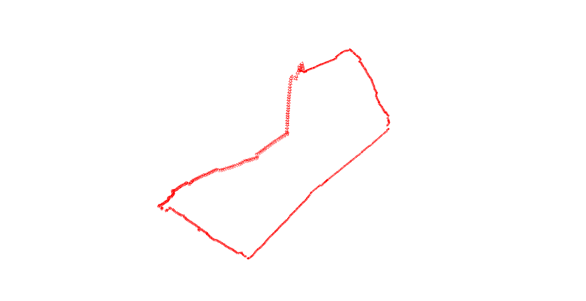

三維電腦視覺HW3 
姓名:葉冠宏   學號:R11943113 

1.作業環境:python 
安裝套件: 
open3d 
numpy 
cv2 
sys  
os 
argparse 
glob 

2.執行方式: 
python vo.py --input ./frames/ --camera_parameters camera_parameters.npy 
其中./frames/ 為image檔所放置的位置。camera_parameters.npy 為camera 的內在參數的檔案，即camera_calibration.py執行後所產生的檔案。 

3.實驗結果:

Dataset: 
https://drive.google.com/drive/folders/1hfzItI6Ai9pkgRBvH2Da5c3PlikQGqPU?usp=sharing

Camera Clibration: 
https://youtu.be/FuD6_dZcgrg

Youtube連結: 
https://www.youtube.com/watch?v=WJ-Dt7BL2QM
